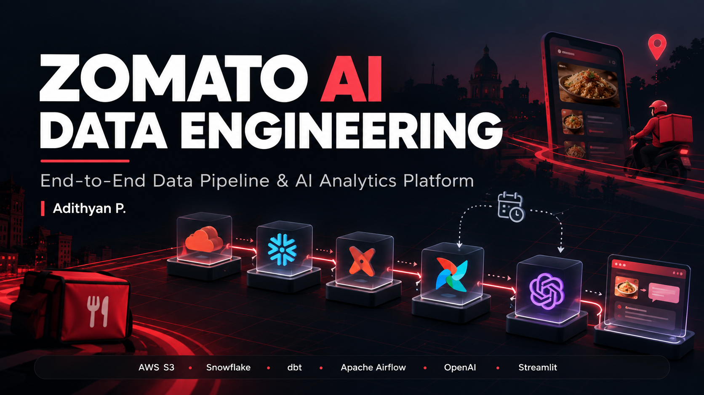

<p align="center">
  
</p>

<h1 align="center">Zomato AI Data Engineering</h1>

<p align="center">
  <strong>End-to-End Batch Data Pipeline & AI Analytics Platform</strong>
</p>

<p align="center">
  Amazon S3 · Snowflake · dbt · Apache Airflow · OpenAI · Streamlit
</p>

---

## 🚀 Overview

**Zomato AI Data Engineering** is an end-to-end data engineering project that transforms large-scale food-delivery data into analytics-ready datasets and AI-powered applications.

The pipeline takes **Zomato-style food delivery data** through a complete modern data stack:

```text
Food Delivery Data
       │
       ▼
   Amazon S3
   Data Lake
       │
       ▼
    Snowflake
   ┌───────────────┐
   │ RAW / Bronze  │
   │ STAGING/Silver│
   │ MARTS / Gold  │
   └───────────────┘
       │
       ▼
      dbt
 Transform + Test
       │
       ▼
   Apache Airflow
   Orchestration
       │
       ├───────────────┐
       ▼               ▼
   AI Enrichment    AI Analytics
       │               │
       ▼               ▼
    OpenAI        RAG + Text-to-SQL
       │               │
       └───────┬───────┘
               ▼
           Streamlit
```

The project combines **cloud storage, data warehousing, ELT, dimensional modeling, incremental processing, orchestration, data quality testing, LLM enrichment, RAG, and natural-language SQL** into one pipeline.

---

## 🎯 What This Project Builds

The pipeline processes:

| Data | Scale |
|---|---:|
| Restaurants | Dimension data |
| Users | Dimension data |
| Food | Dimension data |
| Menu | Dimension data |
| Orders | **10M+ rows** |
| Order Items | **~23M rows** |
| Reviews | **300K reviews** |
| Raw dataset | **~2.3 GB** |

The final platform supports three major AI capabilities:

### 1. LLM Review Enrichment

Free-text reviews are processed using OpenAI to generate structured attributes such as:

- Sentiment
- Topic

The enriched data is written back into Snowflake and becomes part of the downstream analytics layer.

### 2. RAG — Chat With Reviews

Users can ask questions about customer reviews.

The application:

```text
Question
   ↓
Embedding
   ↓
Similarity Retrieval
   ↓
Relevant Reviews
   ↓
LLM
   ↓
Grounded Answer + Sources
```

### 3. Text-to-SQL — Chat With the Warehouse

Users can ask analytical questions in natural language.

```text
"What was the average order value in Bangalore last month?"
                    ↓
                 OpenAI
                    ↓
             SQL Generation
                    ↓
             SELECT Validation
                    ↓
               Snowflake
                    ↓
              Query Result
```

The generated SQL is restricted through a **SELECT-only validation layer** before execution.

---

## 🏗️ Architecture


### End-to-End Flow

```text
                    ┌─────────────────────┐
                    │  Food Delivery Data │
                    │       CSV Files     │
                    └──────────┬──────────┘
                               │
                               ▼
                    ┌─────────────────────┐
                    │     Amazon S3       │
                    │     Data Lake       │
                    └──────────┬──────────┘
                               │
                         Storage Integration
                         + IAM Role
                               │
                               ▼
                    ┌─────────────────────┐
                    │      Snowflake      │
                    │                     │
                    │  RAW → STAGING      │
                    │         → MARTS     │
                    └──────────┬──────────┘
                               │
                               │ dbt
                               ▼
                    ┌─────────────────────┐
                    │ Analytics Layer     │
                    │                     │
                    │ Dimensions          │
                    │ Incremental Facts   │
                    │ Business Marts      │
                    │ SCD Type 2          │
                    └──────────┬──────────┘
                               │
                               ▼
                    ┌─────────────────────┐
                    │     AI Layer        │
                    │                     │
                    │ LLM Enrichment      │
                    │ RAG                 │
                    │ Text-to-SQL         │
                    └──────────┬──────────┘
                               │
                               ▼
                    ┌─────────────────────┐
                    │     Streamlit       │
                    │  Dashboards + AI    │
                    └─────────────────────┘

                 Apache Airflow
                 orchestrates
                 the pipeline
```

---

# 🔄 Data Pipeline

## 1. Data Ingestion — Amazon S3

The project uses seven CSV datasets:

```text
restaurants/
users/
food/
menu/
orders/
order_items/
reviews/
```

They are uploaded to:

```text
s3://<BUCKET>/raw/<table>/
```

S3 acts as the project's **raw data lake** and separates object storage from the analytical warehouse.

---

## 2. S3 → Snowflake

Snowflake accesses S3 using a **Storage Integration + AWS IAM Role**.

No AWS access keys are stored in the pipeline.

```text
                 AWS
        ┌──────────────────┐
        │       S3         │
        │   Raw CSV Data   │
        └────────┬─────────┘
                 │
                 │ IAM Role
                 │
        ┌────────▼─────────┐
        │ Storage          │
        │ Integration      │
        └────────┬─────────┘
                 │
                 ▼
        ┌──────────────────┐
        │    Snowflake     │
        │ External Stage   │
        └──────────────────┘
```

The AWS/Snowflake handshake uses:

- S3 read-only IAM policy
- IAM role
- Snowflake storage integration
- Snowflake IAM user ARN
- External ID

### Important implementation detail

The trust policy must use Snowflake's generated IAM user ARN rather than `:root`.

The external ID generated by the storage integration must also remain consistent with the AWS trust relationship.

The configuration scripts are provided under:

```text
aws/iam/
snowflake/
```

---

# 🥉🥈🥇 Medallion Architecture

The Snowflake warehouse follows a **Bronze → Silver → Gold** architecture.

| Layer | Schema | Purpose |
|---|---|---|
| 🥉 Bronze | `ZOMATO.RAW` | Raw source data |
| 🥈 Silver | `ZOMATO.STAGING` | Cleaned and standardized data |
| 🥇 Gold | `ZOMATO.MARTS` | Analytics-ready business models |
| 🤖 AI | `ZOMATO.AI` | LLM-enriched and AI-specific data |

---

## 🥉 Bronze — RAW

Raw CSV data is loaded into Snowflake using:

```sql
COPY INTO
```

The RAW tables preserve the source structure while providing a queryable foundation for downstream transformations.

The largest datasets include:

- 10M+ orders
- ~23M order items
- 300K reviews

---

## 🥈 Silver — STAGING

dbt staging models clean and standardize the raw data.

Examples include:

- Converting `--` into `NULL`
- Converting values such as `₹ 200` into numeric values
- Standardizing column names
- Lowercasing email addresses
- Deriving delivery-status fields
- Casting columns into appropriate data types

Each source gets its own staging model.

---

## 🥇 Gold — MARTS

The Gold layer contains analytics-ready dimensional and fact models.

### Dimensions

```text
dim_restaurants
dim_customer
dim_food
dim_date
```

### Incremental Facts

```text
fct_orders
fact_order_items
```

The large fact tables use dbt's incremental materialization with a **MERGE strategy**.

Instead of rebuilding millions of records during every run:

```text
First run
10M+ rows
    ↓
Full build

Future runs
New / changed rows
    ↓
MERGE
    ↓
Existing table
```

This makes repeated pipeline execution significantly more practical for large fact tables.

---

## 📊 Business Marts

The Gold layer contains marts designed around business questions rather than raw source structures.

Examples include:

### Daily City Revenue

Provides metrics such as:

- GMV
- AOV
- Cancellation rate
- Daily revenue trends

### Restaurant Performance

Analyzes restaurant-level performance and order activity.

### Delivery SLA

Provides delivery-time statistics including:

- p50
- p90
- City-level performance
- Hour-level performance

### Review Insights

Combines customer review information with the AI enrichment layer.

---

# 🧪 Data Quality

Data quality is handled directly within the dbt pipeline.

The project uses tests such as:

```text
unique
not_null
relationships
accepted_values
```

A custom reconciliation test is also included.

The pipeline uses:

```bash
dbt build
```

so models and tests execute according to their dependency graph.

Conceptually:

```text
Source
  ↓
Staging
  ↓
Tests
  ↓
Dimensions / Facts
  ↓
Tests
  ↓
Business Marts
```

This prevents downstream models from silently consuming invalid upstream data.

---

# ⏱️ Orchestration — Apache Airflow

The entire pipeline is orchestrated as a single daily Airflow DAG.

```text
┌─────────────┐
│ reload_raw  │
└──────┬──────┘
       │
       ▼
┌─────────────────┐
│ dbt_build_core  │
└────────┬────────┘
         │
         ▼
┌─────────────────┐
│ enrich_reviews  │
└────────┬────────┘
         │
         ▼
┌───────────────┐
│ dbt_build_ai  │
└───────────────┘
```

### Pipeline responsibilities

| Task | Responsibility |
|---|---|
| `reload_raw` | Load source data from S3 |
| `dbt_build_core` | Transform and test core warehouse models |
| `enrich_reviews` | Generate AI review attributes |
| `dbt_build_ai` | Build downstream AI marts |

Airflow runs inside Docker.

Credentials are injected through environment variables rather than being hardcoded into the source code.

---

# 🤖 AI Engineering Layer

The AI layer is intentionally treated as part of the **data pipeline**, rather than as a completely separate application.

This creates three different AI/data-engineering patterns.

---

## 1. LLM as a Data Transformation

`ai/enrich_reviews.py`

```text
Snowflake Reviews
       ↓
Review Text
       ↓
OpenAI
       ↓
Structured JSON
       ↓
Sentiment + Topic
       ↓
ZOMATO.AI.REVIEW_ENRICHED
       ↓
dbt
       ↓
Review Insights Mart
```

The enrichment process is designed to be:

- Structured
- Idempotent
- Sample-capped
- Reusable by downstream dbt models

A processed review is not repeatedly enriched, helping avoid unnecessary API calls and costs.

---

## 2. RAG — Retrieval-Augmented Generation

`ai/rag_chat.py`

The RAG application allows users to interact with the review dataset conversationally.

```text
User Question
      ↓
Embedding Model
      ↓
Vector Similarity Search
      ↓
Relevant Reviews
      ↓
Context
      ↓
LLM
      ↓
Grounded Response
```

The application returns answers grounded in retrieved reviews rather than relying only on the model's internal knowledge.

---

## 3. Text-to-SQL

`ai/text_to_sql.py`

The text-to-SQL application exposes the warehouse through natural language.

```text
Natural Language
      ↓
OpenAI
      ↓
SQL Generation
      ↓
SELECT-only Validation
      ↓
Snowflake
      ↓
Results
```

The model receives the schema of the analytical marts and generates SQL against the warehouse.

A validation layer prevents non-SELECT statements from being executed.

The query runs using the `DBT_ROLE`.

---

# 🛠️ Technology Stack

### Data Engineering

- Python
- Pandas
- Amazon S3
- Snowflake
- SQL

### Transformation

- dbt
- dbt-snowflake
- Medallion Architecture
- Incremental Models
- MERGE Strategy
- SCD Type 2

### Orchestration

- Apache Airflow 3
- Docker
- PostgreSQL

### AI / ML

- OpenAI `gpt-4o-mini`
- OpenAI `text-embedding-3-small`
- LLM-based enrichment
- RAG
- Text-to-SQL

### Application

- Streamlit

---

# 📁 Repository Structure

```text
.
├── airflow/
│   ├── Dockerfile
│   ├── docker-compose.yaml
│   ├── example.env
│   └── dags/
│       └── zomato_batch.py
│
├── zomato/
│   ├── models/
│   │   ├── staging/
│   │   └── marts/
│   └── macros/
│
├── ai/
│   ├── enrich_reviews.py
│   ├── rag_chat.py
│   ├── text_to_sql.py
│   └── example.env
│
├── snowflake/
│   ├── 01_setup.sql
│   ├── 02_storage_integration.sql
│   ├── 03_stage_and_formats.sql
│   ├── 04_raw_tables.sql
│   └── 05_copy_into.sql
│
├── aws/
│   └── iam/
│       ├── s3-read-policy.json
│       ├── snowflake-role-trust-policy-initial.json
│       └── snowflake-role-trust-policy-final.json
│
├── docs/
│   ├── cover.png
│   └── architecture.png
│
└── README.md
```

> The `data/` directory, logs, and dbt `target/` artifacts are intentionally excluded from the repository.

---

# 🔐 Security & Configuration

Credentials are intentionally kept outside the source code.

The project uses environment variables for:

```text
SNOWFLAKE_ACCOUNT
SNOWFLAKE_USER
SNOWFLAKE_PASSWORD
OPENAI_API_KEY
```

Airflow also uses:

```text
AIRFLOW_CONN_SNOWFLAKE_DEFAULT
```

Example environment templates are provided in:

```text
airflow/example.env
ai/example.env
```

**Never commit real credentials, API keys, passwords, or cloud secrets to GitHub.**

---

# ▶️ Running the Project

## 1. Configure Snowflake

Create the required Snowflake objects and storage integration.

Run the SQL scripts in order:

```text
snowflake/01_setup.sql
snowflake/02_storage_integration.sql
snowflake/03_stage_and_formats.sql
snowflake/04_raw_tables.sql
snowflake/05_copy_into.sql
```

Configure the corresponding AWS IAM policies under:

```text
aws/iam/
```

---

## 2. Run dbt

```bash
cd zomato

export SNOWFLAKE_ACCOUNT=...
export SNOWFLAKE_USER=...
export SNOWFLAKE_PASSWORD=...

dbt debug
dbt build --exclude tag:ai
```

---

## 3. Start Airflow

```bash
cd airflow

cp example.env .env

docker compose build
docker compose up -d
```

Open:

```text
http://localhost:8080
```

Un-pause the:

```text
zomato_batch
```

DAG and trigger it.

---

## 4. Run AI Enrichment

```bash
export OPENAI_API_KEY=sk-...

python ai/enrich_reviews.py
```

---

## 5. Launch the AI Applications

### RAG

```bash
streamlit run ai/rag_chat.py
```

### Text-to-SQL

```bash
streamlit run ai/text_to_sql.py
```

---

# 📦 Dataset & Project Slides

The complete dataset and project presentation are available here:

[Google Drive — Dataset + Project Slides](https://drive.google.com/drive/folders/1FEnGWMHhHzzTUCZOw1-YnH2v3DMuM-rs?usp=sharing)

The dataset is approximately **2.3 GB**, so the CSV files are intentionally not committed to GitHub.

Download the datasets and place them under:

```text
data/
```

---

# 💡 Key Engineering Decisions

This project was built around several practical engineering considerations.

### Keyless Cloud Access

S3 → Snowflake uses a storage integration and IAM role rather than embedding AWS credentials in the pipeline.

### Incremental Processing

Large fact tables use dbt incremental models and MERGE rather than rebuilding millions of records on every run.

### Separation of Concerns

The project separates:

```text
Storage
   ↓
Warehouse
   ↓
Transformation
   ↓
Orchestration
   ↓
AI Processing
   ↓
Applications
```

### Data Quality

dbt tests are executed as part of the transformation workflow rather than being treated as a separate manual step.

### AI as a Pipeline Component

LLM enrichment is treated as a transformation stage whose output can be consumed by downstream warehouse models.

### Controlled Text-to-SQL

Generated SQL is validated before execution, with the application restricted to SELECT queries.

### Idempotent AI Processing

Review enrichment avoids repeatedly processing the same records, reducing unnecessary model calls.

---

# 📈 What This Project Demonstrates

This project brings together several concepts commonly used in modern data platforms:

```text
                    DATA ENGINEERING
                           │
       ┌───────────────────┼───────────────────┐
       │                   │                   │
   Data Lake          Data Warehouse      Orchestration
       │                   │                   │
      S3                Snowflake          Airflow
                           │
                          dbt
                           │
                  ┌────────┴────────┐
                  │                 │
             Data Modeling      Data Quality
                  │                 │
                  └────────┬────────┘
                           │
                         AI/ML
                           │
              ┌────────────┼────────────┐
              │            │            │
         LLM Enrichment    RAG     Text-to-SQL
              │            │            │
              └────────────┼────────────┘
                           │
                       Streamlit
```

---

# 👨‍💻 Author

**Adithyan P.**

AI & ML Engineering Student  
Bengaluru, India

- GitHub: [Adithyan1809](https://github.com/Adithyan1809)
- Portfolio: [adithyanp.me](https://www.adithyanp.me/)

---

<p align="center">
  Built to explore modern data engineering, cloud data platforms, and AI-powered analytics.
</p>
